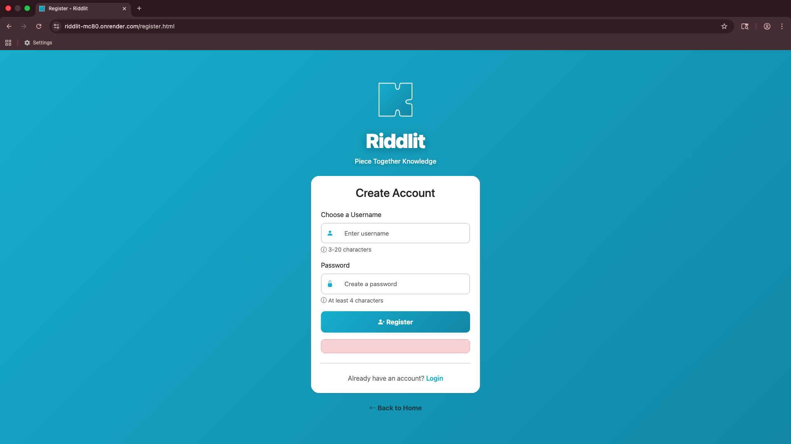
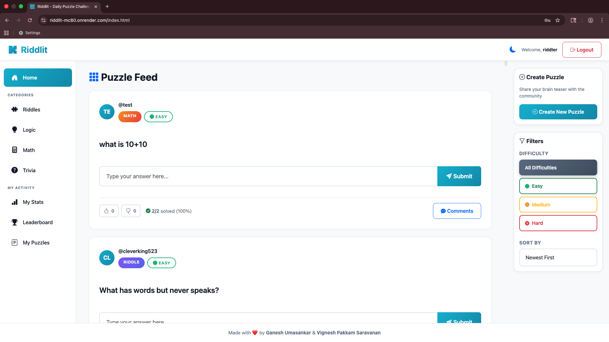

# Riddlit - Brain Teaser Challenge Platform

A community-driven puzzle platform where users create and solve brain teasers, riddles, logic puzzles, and trivia questions. Built as a full-stack web application with social features including voting, comments, and competitive leaderboards.

## Objective

This project demonstrates full-stack web development skills through a complete CRUD application. It showcases user authentication, database design with multiple collections, RESTful API development, client-side rendering, and complex user interaction patterns. The platform encourages daily engagement through solve streak tracking and provides creators with detailed analytics on puzzle performance.

## Authors

**Ganesh Umasankar**  
MS Computer Science Student  
Northeastern University, Boston, MA

Email: umasankar.g@northeastern.edu

**Vignesh Pakkam Saravanan**  
MS Computer Science Student  
Northeastern University, Boston, MA

Email: pakkamsaravanan.v@northeastern.edu

## Academic Reference

**Course:** CS5610 - Web Development  
**Institution:** Northeastern University  
**Semester:** Fall 2025  
**Course Website:** [https://johnguerra.co/classes/webDevelopment_online_fall_2025/](https://johnguerra.co/classes/webDevelopment_online_fall_2025/)

## Documentation & Resources

### Project Documentation

- **Design Document:** [Design Documentation](Riddlit_Design-Document.pdf)
- **Presentation:** [Slides](https://docs.google.com/presentation/d/1xPm9M039GLZMHk8mcZV7HL1qMxUPVnFYUQoDz7TnTl4/edit?usp=sharing)
- **Video Demo:** [Web-app Walkthrough](https://drive.google.com/file/d/1G6D1KT1ejUvMnTHB7NIBtEe12HCBhH70/view?usp=sharing)
- **Live Website:** [Live Site](https://riddlit-mc80.onrender.com)
- **Source Code:** [GitHub Repository](https://github.com/Ganesh-U/riddlit)

## Screenshots

### Landing page


_Landing page_

### Register page


_User Registration page_

### Login page


_User Login page_

### Puzzle feed


_Puzzle feed after logging in_

### Filtering puzzles


_Filter puzzles by category and/or difficulty_

### Solving puzzle correctly


_Solve a puzzle correctly_

### Incorrect attempt


_Attempt to solve a puzzle incorrectly_

### Comments


_Add Comments for a puzzle_

### Create puzzle


_Create a puzzle_

### My Puzzles


_View the puzzles I created_

### My Stats


_View my stats so far_

### Leaderboard


_Community rankings showing top solvers and puzzle creators_

### Dark Mode


_Toggle between light and dark themes for comfortable viewing_

## Technology Requirements

### Core Technologies

- **Backend:** Node.js v16+ with Express.js framework
- **Database:** MongoDB with native driver (no Mongoose)
- **Frontend:** Vanilla JavaScript (ES6 Modules)
- **Authentication:** Express-session for session-based auth
- **Styling:** Custom CSS3 with responsive design

### Development Tools

- **ESLint:** JavaScript linting and code quality
- **Prettier:** Code formatting and consistency
- **Docker:** MongoDB containerization (recommended)
- **Git:** Version control with clear commit history

### Browser Support

- Modern browsers supporting ES6+ features
- Chrome 90+, Firefox 88+, Safari 14+, Edge 90+
- Mobile-responsive design for all screen sizes

## Installation & Usage

### Prerequisites

- Node.js v16 or higher
- MongoDB (local installation or Docker)
- Git for version control
- Modern web browser

### Local Development Setup

```bash
# Clone the repository
git clone https://github.com/YOUR_USERNAME/riddlit.git
cd riddlit

# Install dependencies
npm install

# Setup environment variables
cp .env.example .env
# Edit .env and add your configuration:
# - MONGODB_URI=mongodb://localhost:27017
# - SESSION_SECRET=your-secret-key
# - PORT=3000

# Start MongoDB (if using Docker)
docker run -d -p 27017:27017 --name mongodb mongo:latest

# Seed the database with sample data (creates 1000+ records)
node scripts/seed-data.js

# Start the development server
npm start

# Open browser
# Navigate to http://localhost:3000
```

### Development Commands

```bash
# Start server with auto-reload
npm run dev

# Run ESLint for code quality
npm run lint

# Fix ESLint errors automatically
npm run lint:fix

# Format code with Prettier
npm run format

# Seed database
npm run seed
```

### Project Structure

```
riddlit/
├── public/                    # Frontend files
│   ├── css/                   # Stylesheets
│   │   ├── auth.css           # Login/register styling
│   │   ├── base.css           # Base styles and variables
│   │   ├── components.css     # Reusable UI components
│   │   ├── dark-mode.css      # Dark theme styles
│   │   ├── layout.css         # Page layout structure
│   │   ├── modal.css          # Modal overlays
│   │   ├── puzzle-card.css    # Puzzle card styling
│   │   └── sidebar.css        # Navigation sidebar
│   ├── js/                    # JavaScript ES6 Modules
│   │   ├── api/
│   │   │   └── client.js      # API communication layer
│   │   ├── components/
│   │   │   ├── puzzleCard.js  # Reusable puzzle card
│   │   │   └── toast.js       # Notifications
│   │   ├── pages/
│   │   │   ├── index.js       # Browse puzzles logic
│   │   │   ├── leaderboard.js # Rankings display
│   │   │   ├── my-puzzles.js  # Puzzle management
│   │   │   └── my-stats.js    # User statistics
│   │   ├── utils/
│   │   │   ├── darkMode.js    # Theme switching
│   │   │   └── helpers.js     # Utility functions
│   │   └── auth.js            # Authentication handling
│   ├── favicon.svg            # Site icon
│   ├── index.html             # Browse puzzles page
│   ├── leaderboard.html       # Community rankings
│   ├── login.html             # User login
│   ├── my-puzzles.html        # Puzzle creator dashboard
│   ├── my-stats.html          # User statistics
│   └── register.html          # User registration
├── src/                       # Backend files
│   ├── db/
│   │   └── connection.js      # MongoDB connection
│   ├── middleware/
│   │   └── auth.js            # Authentication middleware
│   ├── routes/                # API endpoints
│   │   ├── commentRoutes.js   # Comment CRUD operations
│   │   ├── puzzleRoutes.js    # Puzzle CRUD operations
│   │   ├── submissionRoutes.js # Answer submission
│   │   ├── userRoutes.js      # User authentication
│   │   └── voteRoutes.js      # Voting system
│   └── server.js              # Express server setup
├── scripts/
│   └── seed-data.js           # Database seeding script
├── .env                       # Environment variables template
├── .gitignore                 # Git ignore rules
├── .prettierrc.json           # Prettier configuration
├── eslint.config.js           # ESLint configuration
├── package.json               # Project dependencies
├── Riddlit_Design_Document.pdf # Design documentation
└── README.md                  # This file
```

## Use of Generative AI

**This project contains a mix of original work and AI-assisted development.**

### AI Tools Used

- **Claude:** Version 4 Sonnet

### Specific AI Assistance

1. **Seed Data Generation:** AI-generated 100+ diverse puzzles across all categories (Riddles, Logic, Math, Trivia) with varying difficulty levels to populate the database with realistic content
2. **Debugging Support:** AI assistance with MongoDB query optimization and session management issues
3. **CSS Troubleshooting:** Help resolving dark mode text visibility and responsive design issues
4. **Documentation:** Assistance with README structure and technical documentation formatting
5. **Code Optimization:** Suggestions for improving API error handling and client-side rendering performance
6. **Design Patterns:** Guidance on modular JavaScript architecture and ES6 module organization

### Example Prompts Used

- "Generate 100+ diverse brain teasers, riddles, logic puzzles, math problems, and trivia questions with answers and hints across Easy, Medium, and Hard difficulty levels"
- "Debug this MongoDB aggregation query for calculating user statistics with solve counts and streaks"
- "Review this Express route for security vulnerabilities and suggest improvements"
- "How can I improve dark mode contrast for better text visibility across all components?"
- "Create comprehensive README documentation following academic portfolio format with all required sections"

### Original Work

- Complete application architecture and design decisions
- User interface design and user experience flow
- Database schema design and relationships
- All business logic and feature implementation
- Integration of all components into cohesive application
- Testing and debugging of complete system

## Future Enhancements

- Content moderation and reporting system for inappropriate content/comments
- Password hashing (bcrypt) and OAuth integration for enhanced security
- Image-based puzzles and visual riddles
- Time-limited speed challenges with bonus scoring

## License

This project is licensed under the MIT License - see the [LICENSE](LICENSE) file for details.

---

**Built with ❤️ by Ganesh Umasankar & Vignesh Pakkam Saravanan for CS 5610 Web Development**
